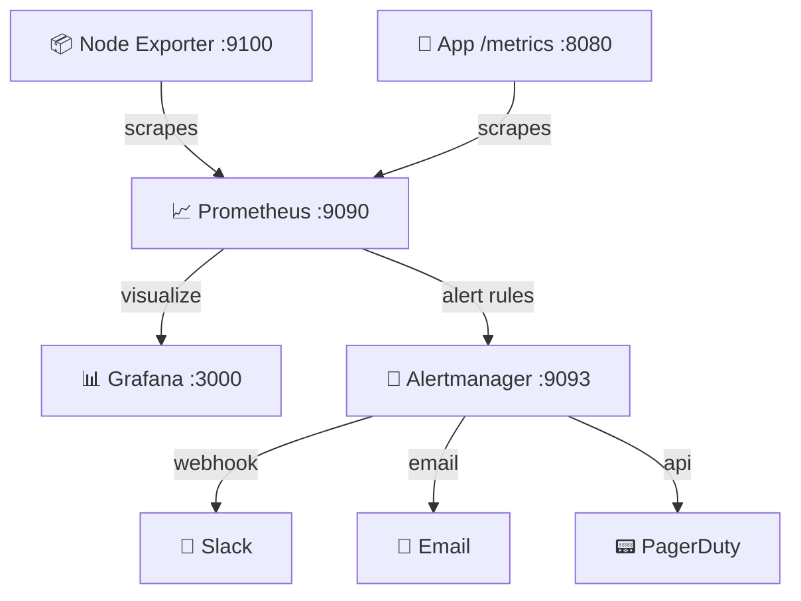

# 📈 Advanced Monitoring Script Generator
> **Deploy secure telemetry layers. Generate production-ready bash installation recipes for Prometheus, node_exporter daemon metrics, and Grafana dashboard charts.**

[](https://pradeeptalari14.github.io/portfolio/tools/monitoring/)
[]()

---

## 🎛️ Studio Options — What the UI Generates

The studio has multiple configurable options. Each combination produces different output files.
This repository contains **one working example per option variant** so you can learn by diffing.

### Output Tabs (files the studio generates)
| Tab | Description |
|-----|-------------|
| `install.sh / docker-compose / k8s-yaml` | Generated in studio Output tab |
| `prometheus.yml` | Generated in studio Output tab |
| `node-exporter.service` | Generated in studio Output tab |
| `Flow Diagram` | Generated in studio Output tab |
| `Grafana Dashboard JSON` | Generated in studio Output tab |

### Configurable Options
| Option | Available Values |
|--------|-----------------|
| **Install Type** | `System (bare-metal)` / `Docker Compose` / `Kubernetes` |
| **Prometheus** | `enabled` / `disabled` |
| **Node Exporter** | `enabled` / `disabled` |
| **Grafana** | `enabled` / `disabled` |
| **Systemd** | `enabled` / `disabled` |
| **Additional Scrape Hosts** | `enabled` / `disabled` |

---

## 🏗️ Architecture Flow Diagram




---

## 📁 Repository Structure

```
tp-monitoring/
├── README.md          ← This file — complete learning guide
├── examples/system/install.sh
├── examples/docker/docker-compose.yml
├── examples/kubernetes/prometheus-k8s.yaml
├── prometheus/prometheus.yml
├── prometheus/alert-rules/critical.yml
├── node-exporter.service
├── alertmanager/alertmanager.yml
├── scripts/           ← Deployment + validation helpers
└── docs/USAGE.md      ← Extended usage guide
```

---

## ⚡ Quick Start

### Step 1 — Generate files from the Studio
1. Open **[Advanced Monitoring Script Generator Studio](https://pradeeptalari14.github.io/portfolio/tools/monitoring/)**
2. Select your option values in the UI
3. Watch the output update live in the editor
4. Click **Download** or **Copy** for each tab

### Step 2 — Use the example files in this repo
```bash
git clone https://github.com/Pradeeptalari14/tp-monitoring.git
cd tp-monitoring
# Browse examples/ to find the variant matching your needs
# Copy the relevant files into your project
```

---

## 🔄 Complete Start-to-End Workflow


---

## 📖 How Each Option Changes the Output

### Install Type
- **`System (bare-metal)`** — see `examples/` folder for generated output
- **`Docker Compose`** — see `examples/` folder for generated output
- **`Kubernetes`** — see `examples/` folder for generated output

### Prometheus
- **`enabled`** — see `examples/` folder for generated output
- **`disabled`** — see `examples/` folder for generated output

### Node Exporter
- **`enabled`** — see `examples/` folder for generated output
- **`disabled`** — see `examples/` folder for generated output

### Grafana
- **`enabled`** — see `examples/` folder for generated output
- **`disabled`** — see `examples/` folder for generated output

### Systemd
- **`enabled`** — see `examples/` folder for generated output
- **`disabled`** — see `examples/` folder for generated output

### Additional Scrape Hosts
- **`enabled`** — see `examples/` folder for generated output
- **`disabled`** — see `examples/` folder for generated output

---

## 💡 SRE Compliance & Best Practices

| SRE Compliance Pillar | ❌ Anti-Pattern | ✅ Production Best Practice |
|---|---|---|
| **Alerting Quality** | Threshold rules on CPU/Memory usage metrics | Configure alerts targeting Service Level Indicators (latency, error rates) |
| **Data Retention** | Storing metric data indefinitely | Enforce storage size limits (`--storage.tsdb.retention.size`) |
| **Scrape Reliability** | Direct hardcoded endpoint IPs | Use Service Discovery configurations (Consul/DNS/Kubernetes API endpoints) |

## 🔐 Security Standards

- ❌ Never commit credentials, API keys, or database passwords directly to Git repositories.
- ✅ Reference dynamic parameters using cloud Secret Managers (Vault, AWS SSM Parameter Store, Key Vault).
- ✅ Enforce branch protection rules: require peer pull request reviews and green status checks.

---

## 📖 Resources

| Resource | Link |
|----------|------|
| Interactive Studio | [Open →](https://pradeeptalari14.github.io/portfolio/tools/monitoring/) |
| All 91 Studios | [Dashboard →](https://pradeeptalari14.github.io/portfolio/tools/) |
| SRE Provisioning Guide | [Handbook →](https://github.com/Pradeeptalari14/portfolio/blob/main/GITHUB_PROVISIONING_GUIDE.md) |

---
*Generated by [Advanced Monitoring Script Generator Studio](https://pradeeptalari14.github.io/portfolio/tools/monitoring/) — [Talari Pradeep Portfolio](https://pradeeptalari14.github.io/portfolio)*